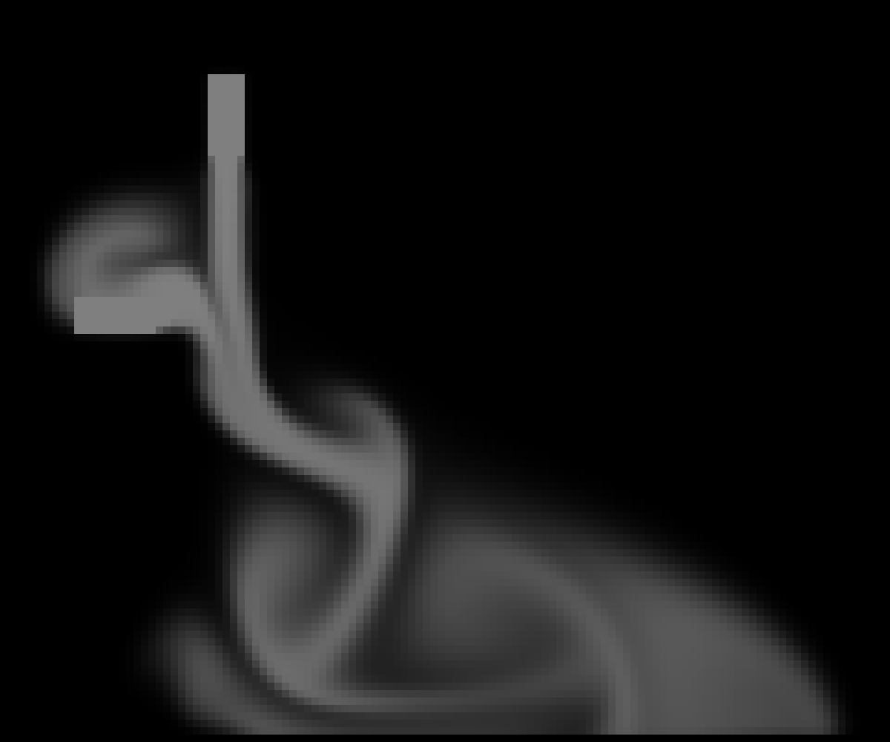
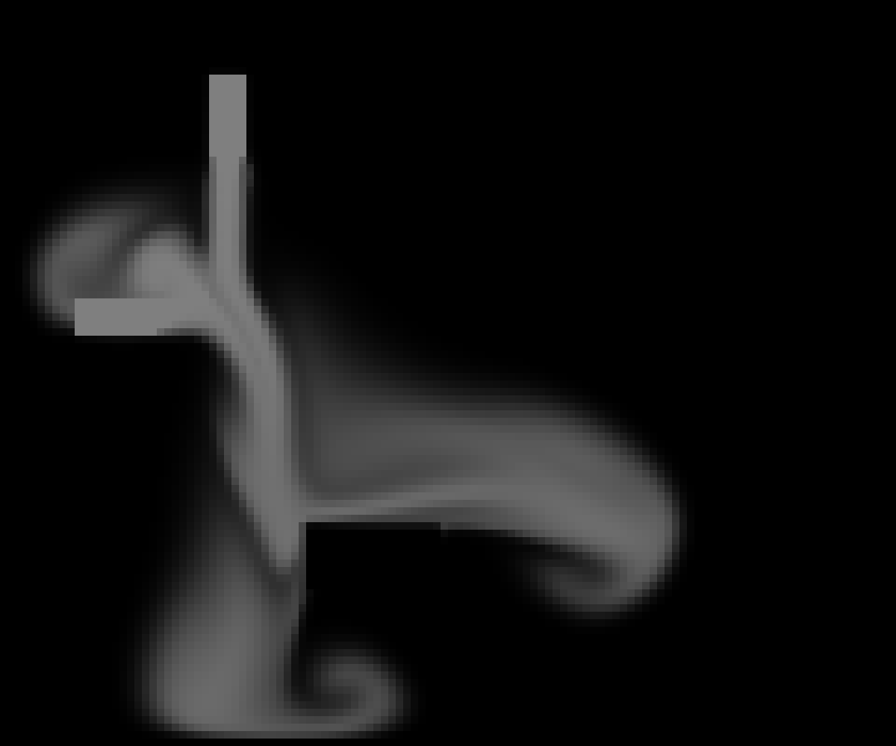
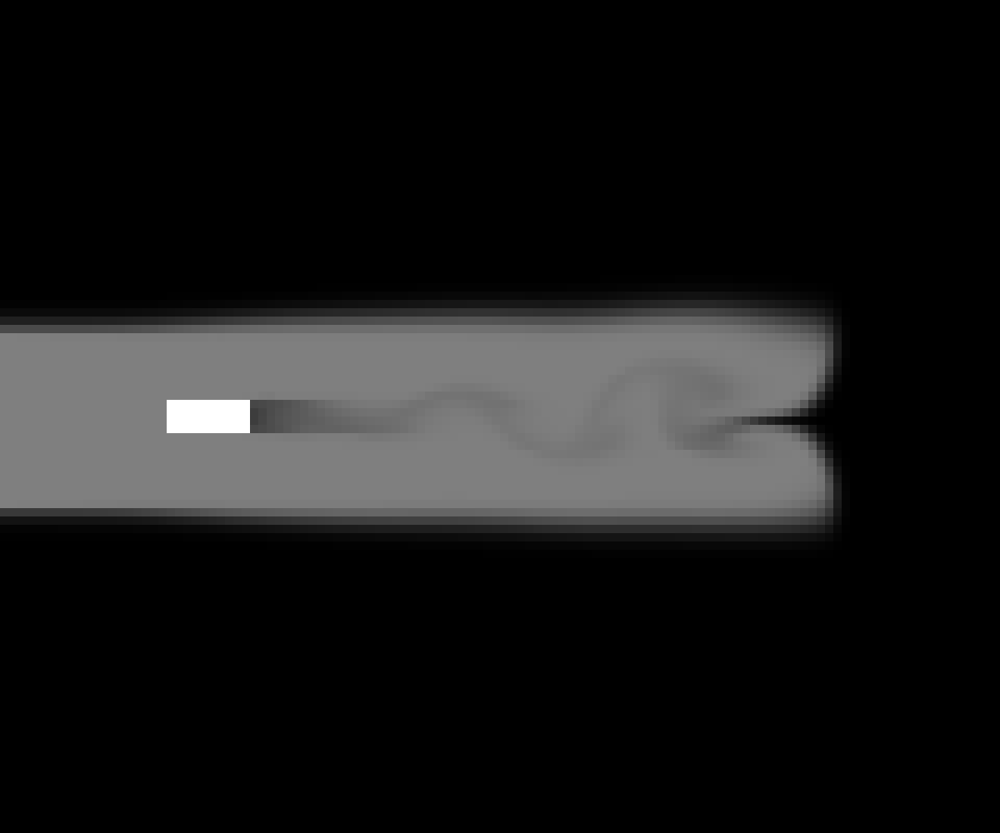

# Navier-Stokes
A numeric solver for Navier-Stokes equations. My [wind tunnel simulation project](https://github.com/gregora/Wind-Tunnel) was derived from this library.

[https://www.youtube.com/watch?v=mPZd5Lwb0C4](https://www.youtube.com/watch?v=mPZd5Lwb0C4)

https://github.com/gregora/Navier-Stokes/assets/26600857/768d9d3f-e387-4fc4-a2e8-88951ca40ec4

## Theory

The Navier-Stokes equations for incompressible flow are a set of partial differential equations that describe the motion of fluid substances. They are derived as a result of the application of Newton's second law to fluid motion, together with the assumption that the fluid is incompressible. The equations are as follows:

$$
\frac{\partial \mathbf{u}}{\partial t} + (\mathbf{u} \cdot \nabla) \mathbf{u} = -\frac{1}{\rho} \nabla p + \nu \nabla^2 \mathbf{u} + \mathbf{f}
$$

$$
\nabla \cdot \mathbf{u} = 0
$$

The first equation is the momentum equation, which describes how the velocity field $\mathbf{u}$ changes over time. The left-hand side of the equation represents the acceleration of the fluid, while the right-hand side represents the forces acting on the fluid. The terms are as follows: $\mathbf{u}$ is the velocity field, $t$ is time, $\rho$ is the fluid density, $p$ is the pressure, $\nu$ is the kinematic viscosity, and $\mathbf{f}$ is the external force field.

The second equation is the continuity equation, which states that the divergence of the velocity field is zero. In other words, the fluid cannot be "squished" or "stretched" in any way.

## Examples

### Example 1 (Colliding plumes)

### Example 2 (Colliding plumes and a wall)

### Example 3 (Wind tunnel)

## Usage

### Dependencies
* SFML
* ffmpeg (rendering only)

### Compilation
Run `make` in the root directory.

### Running
Run `./main.out` in the root directory. The program supports the following command line arguments:
* `-example <example 1-3>` - choose an example to run
* `-energy` - shows the total energy of the system at each time step
* `-time <time>` - sets simulation time to `<time>` seconds
* `-velocities` - render velocity field together with smoke. NOTE: This could significantly slow down the simulation, as `n*m` arrows have to be drawn at each time step
* `-threads <threads>` - number of CPU threads to use
* `-render` - renders the system to a video file in the `render` directory as `output.mp4`
