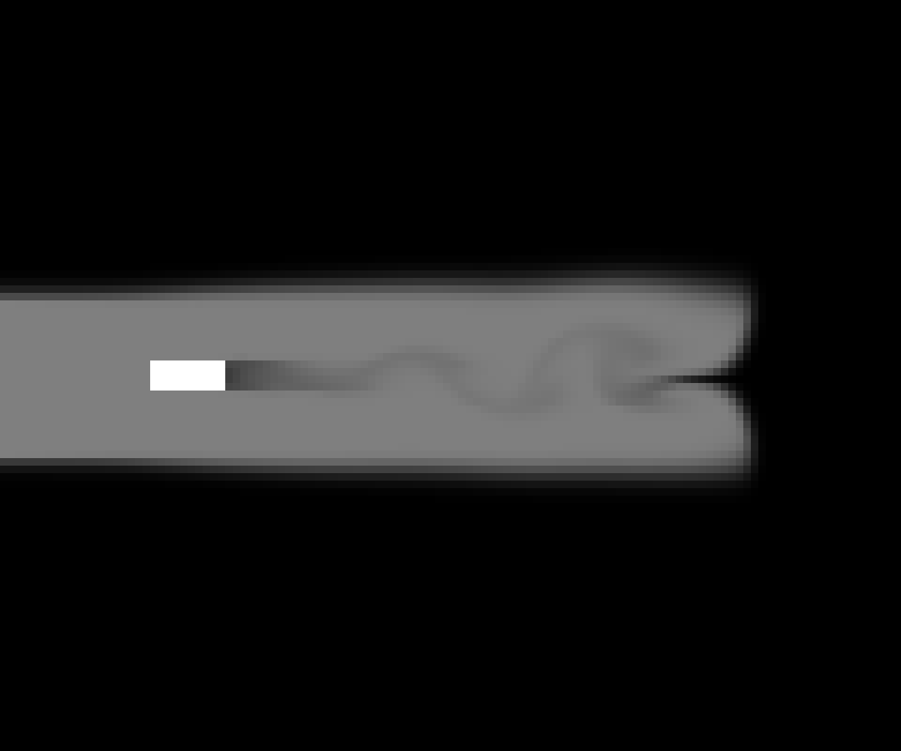

# Navier-Stokes
A numeric solver for Navier-Stokes equations

## Usage

### Dependencies
* SFML
* ffmpeg (rendering only)

### Compilation
Run `make` in the root directory.

### Running
Run `./main.out` in the root directory. The program supports the following command line arguments:
* `-example <example 1-3>` - choose an example to run
* `-energy` - shows the total energy of the system at each time step
* `-time <time>` - sets simulation time to `<time>` seconds
* `-velocities` - render velocity field together with smoke
* `-threads <threads>` - number of CPU threads to use
* `-render` - renders the system to a video file in the `render` directory as `output.mp4`

### Examples

#### Example 1 (Colliding plumes)

#### Example 2 (Colliding plumes and a wall)

#### Example 3 (Wind tunnel)

